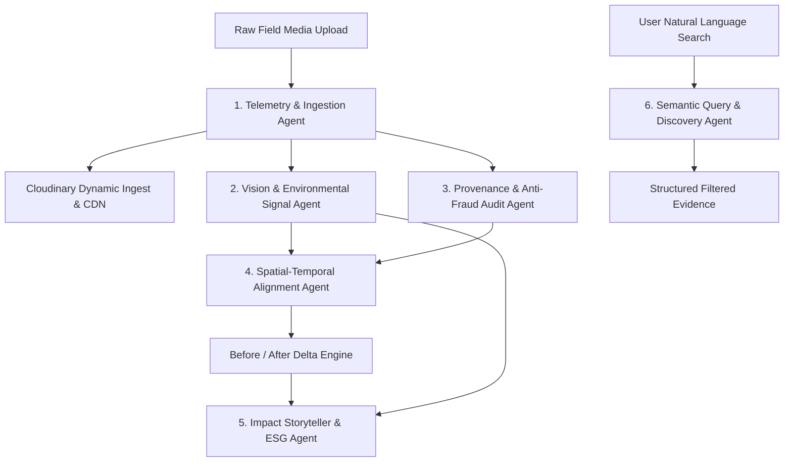

# Autonomous Agents Architecture (AGENTS.md)
## Terraframe — Impact & Sustainability Media Platform

**Architecture Style:** Multi-Agent Pipeline & Event-Driven Collaboration  
**Orchestration Engine:** TypeScript Async Agent Orchestrator with Deterministic Fallbacks  
**AI Vision & Reasoning:** Google Gemini 1.5/2.0 Flash + Structured JSON Schema Enforcement  

---

## 1. System Agent Overview

Terraframe implements a collaborative multi-agent architecture where specialized agents process raw media from field intake through verification, temporal alignment, and impact publication:



---

## 2. Agent Specifications & Roles

### Agent 1: Ingestion & Telemetry Agent (`TelemetryAgent`)
* **Role:** Primary gatekeeper for incoming field assets.
* **Responsibilities:**
  * Extracts raw binary EXIF/IPTC tags (GPS Latitude/Longitude, Altitude, Capture Timestamp, Camera Model, Shutter, ISO).
  * Computes cryptographic SHA-256 fingerprint for non-repudiation.
  * Dispatches media to Cloudinary with structured folder hierarchies (`/projects/:projectId/:year/`).
  * Generates responsive thumbnail and web-optimized transformation URLs.
* **Inputs:** Raw `File` or `Buffer`, project metadata.
* **Outputs:** Normalized `telemetry` object, `cloudinary` metadata object, `sha256Hash`.

### Agent 2: Vision & Environmental Signal Agent (`VisionSignalsAgent`)
* **Role:** Multimodal environmental analyst.
* **Responsibilities:**
  * Analyzes scene content using multimodal LLM (Gemini Vision) or heuristic vision fallbacks.
  * Classifies environmental category: *Reforestation, Marine Cleanup, Renewable Infrastructure, Waste Remediation, or Wildlife Habitat*.
  * Quantifies detectable environmental objects (e.g. sapling count, solar panels, trash collection bags, species presence).
  * Evaluates health indicators (e.g., chlorophyll vitality, water clarity, barren soil reduction).
  * Maps visual evidence directly to UN Sustainable Development Goals (SDG 6, 7, 11, 12, 13, 14, 15).
* **Inputs:** Cloudinary media URL, project domain context.
* **Outputs:** `aiAnalysis` schema (SDG goals, confidence scores, detected objects, environmental signals, narrative).

### Agent 3: Provenance & Anti-Fraud Audit Agent (`AuditVerificationAgent`)
* **Role:** Compliance auditor ensuring visual proof authenticity.
* **Responsibilities:**
  * Checks for temporal contradictions (e.g., capture date claiming 2024, but EXIF software tag reveals Photoshop CS6).
  * Verifies geofencing boundaries against project geographic bounds (flags photos claimed for Kenya taken in Florida).
  * Checks for synthetic AI image generation artifacts or duplicate submission across multiple NGO accounts.
  * Issues a cryptographic verification badge with audit timestamp.
* **Outputs:** `VerificationStatus: 'verified' | 'flagged' | 'pending_manual_audit'`, Audit Checklist score.

### Agent 4: Spatial-Temporal Alignment Agent (`TemporalAlignmentAgent`)
* **Role:** Matchmaker between historical baseline and subsequent progress milestones.
* **Responsibilities:**
  * Computes Haversine GPS proximity between newly uploaded media and existing baseline project assets.
  * Evaluates visual viewpoint overlap (angle and horizon consistency).
  * Automatically pairs baseline ("before") and milestone ("after") assets.
  * Calculates quantified environmental delta:
    $$\Delta\% = \frac{\text{Milestone Metric} - \text{Baseline Metric}}{\text{Baseline Metric}} \times 100$$
* **Inputs:** Target asset, candidate project asset pool.
* **Outputs:** `ComparisonPair` object with time delta in days, physical distance in meters, and progress percentage.

### Agent 5: Impact Storyteller & ESG Agent (`StorytellerAgent`)
* **Role:** Autonomous environmental journalist and grant reporting compiler.
* **Responsibilities:**
  * Synthesizes complex field data, verified before/after visual deltas, and SDG tags into human-readable narratives.
  * Generates multi-tier communication formats:
    1. **Executive ESG Audit Summary** (formal, data-driven, audit-grade for corporate donors).
    2. **Public Donor Impact Story** (inspirational, emotional, storytelling for campaigns).
    3. **Social & Press Release Snippet** (punchy, high-engagement for X/LinkedIn/Instagram with Cloudinary crop coordinates).
* **Inputs:** Project record, verified evidence assets, comparison pairs.
* **Outputs:** Formatted Markdown/PDF impact report and campaign copy bundle.

### Agent 6: Semantic Query & Discovery Agent (`SemanticQueryAgent`)
* **Role:** Natural language search interpreter.
* **Responsibilities:**
  * Parses free-form user questions such as *"Find mangrove plantings in coastal Bengal showing healthy root growth between June and September"*.
  * Extracts search parameters: target SDG, geographic constraints, date bounds, visual object criteria, and verification status.
  * Executes vector/keyword hybrid retrieval across the evidence repository.
* **Inputs:** Natural language string `query`.
* **Outputs:** Structured filter parameters and prioritized relevance-ranked asset matches.

---

## 3. Agent Execution Orchestrator (`AgentRunner`)

All agents implement the standard interface:

```typescript
export interface BaseAgent<TInput, TOutput> {
  name: string;
  description: string;
  run(input: TInput): Promise<AgentResult<TOutput>>;
}

export interface AgentResult<T> {
  success: boolean;
  agentName: string;
  durationMs: number;
  data: T;
  warnings?: string[];
  error?: string;
}
```

The orchestrator guarantees **Graceful Degradation**:
* If the Gemini Vision API quota is reached or offline, `VisionSignalsAgent` falls back to smart contextual pattern matching using EXIF data, project type heuristics, and visual attributes.
* If Cloudinary credentials are absent during local development, `TelemetryAgent` employs a local asset simulator with mock transformation parameters to ensure 100% demo functionality.
