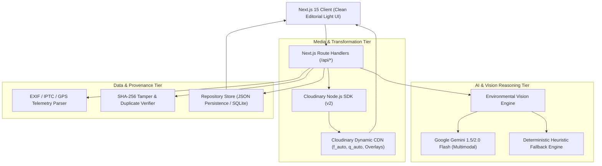

# Technical Requirements Document (TRD)
## AI-Powered Impact & Sustainability Media Platform (VeriTerra AI)

**Architecture Version:** 1.0.0  
**Stack:** Next.js 15 (App Router), TypeScript, Cloudinary SDK, Tailwind CSS, Google Gemini Vision API  
**Target Environment:** Local Node.js v18+ & Vercel Serverless Edge  

---

## 1. System Architecture Overview

VeriTerra AI is structured as a modular, API-first Next.js web application integrating four foundational tiers:



---

## 2. Technology Stack & Dependencies

| Layer | Technology | Rationale |
| :--- | :--- | :--- |
| **Framework** | Next.js 15 (React 19, App Router) | Fast SSR/SSG, built-in API routes, modern streaming, high performance. |
| **Language** | TypeScript 5.x | Strict type safety across media schemas, EXIF payloads, and AI outputs. |
| **Styling** | Tailwind CSS + Custom Tokens | Rapid design system execution adhering to strict light theme parameters. |
| **Icons** | Lucide React | Clean, minimalist, consistent institutional iconography. |
| **Media Pipeline** | Cloudinary v2 SDK | Dynamic transformations, smart focal cropping, watermarking, responsive delivery. |
| **AI / Multimodal** | `@google/genai` or `@google/generative-ai` | Multimodal scene description, visual signal extraction, SDG alignment. |
| **EXIF Parsing** | `exif-parser` / `exifr` | Zero-dependency client & server-side metadata telemetry extraction. |
| **Map & Geo** | Leaflet / React-Leaflet or Custom SVG GeoMap | 100% free interactive spatial clustering with zero API billing barrier. |
| **Persistence** | File-backed JSON Database (`src/lib/db.ts`) | High-speed, zero-config local storage with full demo pre-seeding. |

---

## 3. Data Models & Schemas

### 3.1 Media Evidence Record (`EvidenceAsset`)
```typescript
export interface EvidenceAsset {
  id: string;                         // UUIDv4
  projectId: string;                  // e.g., "proj-sundarbans-mangroves"
  title: string;
  description: string;
  originalFileName: string;
  fileSizeBytes: number;
  mimeType: string;
  sha256Hash: string;                 // Anti-tamper cryptographic fingerprint
  
  // Cloudinary Details
  cloudinary: {
    publicId: string;
    secureUrl: string;
    thumbnailUrl: string;             // c_fill,w_400,h_300,g_auto,f_auto,q_auto
    watermarkedUrl: string;           // With verified GPS/timestamp overlay
    format: string;
    width: number;
    height: number;
    resourceType: 'image' | 'video';
  };

  // Telemetry & Geospatial Data
  telemetry: {
    capturedAt: string;               // ISO 8601 from EXIF
    uploadedAt: string;               // ISO 8601
    gps: {
      latitude: number;
      longitude: number;
      altitudeMeters?: number;
      geoHash: string;
      locationName: string;
    };
    device: {
      make?: string;
      model?: string;
      lens?: string;
    };
    isExifVerified: boolean;
  };

  // AI Environmental Intelligence
  aiAnalysis: {
    sdgGoals: number[];               // e.g. [13, 14, 15]
    confidenceScore: number;          // 0.0 - 1.0
    domainCategory: 'reforestation' | 'marine_cleanup' | 'renewable_energy' | 'waste_mgmt' | 'wildlife';
    detectedObjects: Array<{
      label: string;
      count: number;
      confidence: number;
    }>;
    environmentalSignals: string[];   // ["dense canopy cover", "healthy mangrove roots", "low salinity stress"]
    tags: string[];
    aiNarrative: string;
  };

  // Temporal Pairing State
  milestoneType: 'baseline' | 'intermediate' | 'milestone_achieved';
  matchedPairId?: string;             // ID of corresponding baseline or after asset
  status: 'verified' | 'pending_review' | 'flagged';
}
```

### 3.2 Before & After Pair Record (`ComparisonPair`)
```typescript
export interface ComparisonPair {
  id: string;
  projectId: string;
  title: string;
  baselineAssetId: string;
  milestoneAssetId: string;
  timeDeltaDays: number;
  distanceDeltaMeters: number;        // Accuracy of camera position pairing
  quantifiedImpact: {
    metricName: string;               // e.g., "Vegetative Canopy Index"
    baselineValue: number;            // 24%
    milestoneValue: number;           // 72%
    deltaPercentage: number;          // +200%
    unit: string;                     // "% coverage"
    verificationMethod: 'ai_segmentation' | 'pixel_delta' | 'survey_verified';
  };
  summaryStory: string;
  sliderTransformationUrl: string;    // Cloudinary generated split or dual composition
}
```

### 3.3 Project Container (`ImpactProject`)
```typescript
export interface ImpactProject {
  id: string;
  name: string;
  slug: string;
  organization: string;
  country: string;
  region: string;
  coordinates: [number, number];
  primarySdg: number;
  sdgList: number[];
  category: 'Reforestation' | 'Ocean & Water' | 'Renewable Energy' | 'Biodiversity';
  startDate: string;
  targetCompletionDate: string;
  totalAssetsCount: number;
  verifiedAssetsCount: number;
  bannerPublicId: string;
  description: string;
  metrics: {
    metricLabel: string;
    targetValue: number;
    currentValue: number;
    unit: string;
  }[];
}
```

---

## 4. Cloudinary Integration Architecture

### 4.1 Asset Ingestion Strategy
1. **Direct Signed Upload:** Client uploads directly via Cloudinary Signed Upload URL, eliminating backend server upload bottlenecks.
2. **Fallback Server Handler:** Backend `/api/upload` handles uploads, computes SHA-256, strips any sensitive location if privacy-shielded, and delivers to Cloudinary using `cloudinary.v2.uploader.upload_stream`.
3. **Local Dev Mock Fallback:** When `CLOUDINARY_CLOUD_NAME` is not configured, the system transparently utilizes local static uploads and high-quality curated sample assets with simulated Cloudinary dynamic transformation URLs.

### 4.2 Cloudinary URL Transformation Rules
* **Standard Card Thumbnail:**  
  `https://res.cloudinary.com/<cloud>/image/upload/c_fill,w_600,h_400,g_auto,f_auto,q_auto/<public_id>`
* **Smart Focal Crop (16:9 Hero):**  
  `https://res.cloudinary.com/<cloud>/image/upload/c_fill,ar_16:9,g_auto,f_auto,q_auto/<public_id>`
* **Dynamic Verified Watermark Overlay:**  
  `https://res.cloudinary.com/<cloud>/image/upload/l_text:Arial_20_bold:VERITERRA%20VERIFIED%20PROOF,co_rgb:FFFFFF,b_rgb:059669CC,y_20,x_20,g_south_east/f_auto,q_auto/<public_id>`
* **Before / After Composition Visual:**  
  Cloudinary layer overlays or dual-asset rendering using `l_<after_public_id>` with custom displacement or side-by-side stitch.

---

## 5. API Endpoints Specification

### 5.1 Media & Ingestion
* `POST /api/upload`: Receives file `multipart/form-data`, parses EXIF, calculates SHA-256, uploads to Cloudinary, runs initial AI analysis, stores record.
* `GET /api/evidence`: Returns paginated evidence list with filtering (`projectId`, `sdg`, `dateRange`, `status`, `search`).
* `GET /api/evidence/[id]`: Returns single asset with complete audit history and Cloudinary transformation variants.
* `DELETE /api/evidence/[id]`: Soft deletes asset.

### 5.2 Environmental AI & Reasoning
* `POST /api/analyze`: Re-runs or overrides AI analysis for a given asset ID.
* `POST /api/compare`: Takes two asset IDs (Baseline & Milestone), computes spatial-temporal alignment, runs comparative analysis, and generates a `ComparisonPair`.

### 5.3 Semantic Search & Discovery
* `GET /api/search?q={query}`: Natural-language search parsing query intent (e.g. extracts SDG, location keywords, project names, and visual concepts).

### 5.4 Reports & Storytelling
* `POST /api/reports/generate`: Generates an executive impact report synthesizing project assets into markdown and JSON format for download or public web view.

---

## 6. Security, Integrity & Anti-Fraud Architecture

1. **Cryptographic Fingerprinting:** Every raw media file is hashed (SHA-256) before transformation. This hash is embedded into the permanent verification ledger.
2. **EXIF Temporal Consistency:** Flags discrepancies if EXIF camera date deviates drastically from upload date or contains editing software signatures (e.g., Photoshop, Midjourney metadata).
3. **Non-Destructive CDN Transforms:** Original assets are stored untouched in cold/secure storage; all cropped, watermarked, or enhanced versions are purely URL transformations.
4. **Environment Variables Security:**
   * `CLOUDINARY_CLOUD_NAME`, `CLOUDINARY_API_KEY`, `CLOUDINARY_API_SECRET` kept strictly server-side.
   * `GEMINI_API_KEY` stored exclusively in server environment routes.
